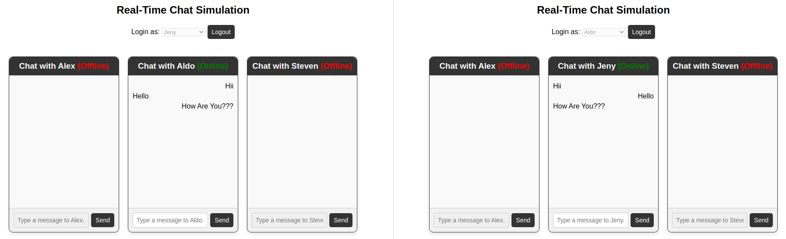

## 📚 **WebSocket Chat Project**

---

This is a learning project aimed at exploring WebSocket communication using Golang with the Gin framework and the Gorilla WebSocket library. The project simulates a simple real-time chat application featuring four predefined users: Alex, Aldo, Jeny, and Steven.

The application allows users to log in through a dropdown menu. Online users are marked with a green "Online" status, while offline users appear with a red "Offline" status. Real-time messaging is implemented using WebSocket connections, enabling instant message delivery to active users. Users can only send messages to others who are online; offline users cannot receive messages.


-------------------------

## 📦 **Tech Stack**

- **Go (Golang)**
- **Gin** - Web framework for Go.
- **Gorilla WebSocket** - WebSocket implementation for Go.

---

## 🚀 **Project Installation**

1. **Clone the Repository**
2. **Install Dependencies**

   ```bash
   go mod tidy
   ```
3. **Run the Project**

   ```bash
   cd backend
   go run .
   ```
4. **Access the Application**
   Open your browser and go to `http://localhost:8080`

---

## 📂 **Project Structure**

```plaintext
websocket-chat/
│── backend/
│   ├── client.go               # WebSocket client logic
│   ├── hub.go                  # WebSocket connection manager
│   └── main.go                 # Application entry point and routing
│
│── frontend/
│   ├── js/
│   │   ├── auth.js             # Logic login button
│   │   ├── chat.js             # WebSocket chat logic
│   │   └── ui.js               # User interface management
│   ├── index.html              # Main application view
│   └── styles.css              # Basic styling for the chat UI
│
│── go.mod                      # Go module dependencies
│── go.sum                      # Dependency checksums
```

---

## 🔧 **Branches**

- **main**: Main implementation of the WebSocket Chat.
- **scratch**: Basic version for initial exploration.
